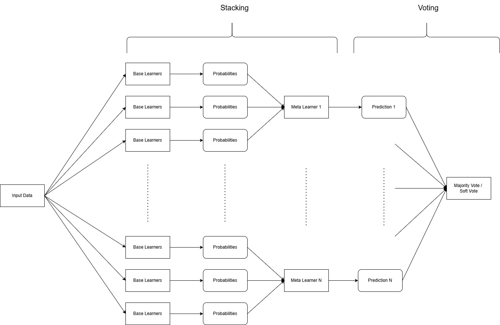

# Hoax‑News‑Detection 📰

A **Streamlit**‑based web app that detects hoax (fake) news by analyzing the content of a text and predicting its credibility using a trained machine‑learning model. Using a combination of Voting + Stacking Classifier.

The dataset was atteind from here: [False News Dataset](https://www.kaggle.com/datasets/muhammadghazimuharam/indonesiafalsenews)

### Model Architecture



## 🚀 Features

- **DIY Training** Stacking + Voting Model
- Enter any news and get a prediction: **"Hoax"** or **"Non Hoax"**
- **Preprocessing** Explanation Page
- **Model Explanation** Page

## ⚙️ Installation & Setup

🐍 Requires **Python 3.12**  
We strongly recommend using a virtual environment

1. **Clone the repo**

   ```bash
   git clone https://github.com/0wLzz/Hoax-News-Detection.git
   cd Hoax-News-Detection

   ```

2. **Create & Activate the virtual environment**

   ```bash
    python3.12 -m venv FakeNews

    # Windows
    venv\Scripts\activate

    # Mac/Linux
    source venv/bin/activate

   ```

3. **Install dependencies**

   ```bash
   pip install -r requirements.txt

   ```

4. **Start the Streamlit App**

   ```bash
   streamlit run streamlit_app.py

   ```

5. **Open the Application**

   Then open your browser and visit this url: http://localhost:8501
